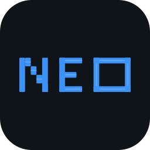

<div align="center">



# Neo

**A local-first agentic AI coding assistant for your desktop.**

<br />

<a href="https://github.com/erphq/neo-releases/releases/latest/download/Neo_0.1.2_aarch64.dmg">
  
</a>
&nbsp;&nbsp;
<a href="https://github.com/erphq/neo-releases/releases/latest/download/Neo_0.1.2_x64-setup.exe">
  
</a>

<br /><br />


[](https://github.com/erphq/neo-releases/releases/latest)

[**What is Neo**](#what-is-neo) · [**Features**](#features) · [**Install**](#install) · [**Auto-updates**](#auto-updates) · [**Support**](#support--issues)

</div>

<br />

This repository hosts signed + notarized builds of [**Neo**](https://github.com/erphq/neo). Source code lives in the main [erphq/neo](https://github.com/erphq/neo) repo — this one only holds release artifacts.

<br />

## What is Neo

Neo is an AI coding assistant that lives on your desktop. Open a folder, ask it to do something, and it reads your code, writes files, runs commands, and gets the job done — all on your machine.

No browser tab. No cloud sync. No subscription. Just a native desktop app that pairs with your editor.

> *"I know kung fu."* — You, after Neo writes your entire test suite.

<br />

## Features

- 🧠 **Works your whole codebase.** Reads files, searches across the project, edits, runs commands — end to end, not one file at a time.
- 🌐 **Searches the web when it needs to.** Grabs docs, pulls in examples, fetches pages.
- 💾 **Remembers what matters.** Keeps cross-session notes in a markdown file — architecture decisions, gotchas, preferences — so you don't repeat yourself.
- 🛡️ **Asks before risky stuff.** Anything that touches your disk or runs a command gets an inline approval prompt. Read-only actions just run.
- 🧩 **Extends with plugins.** Connect databases, GitHub, your own services — Neo auto-discovers and uses them.
- 🧭 **Thinks before it acts.** Big tasks start with a plan you can approve before anything runs.
- 🎨 **Looks how you want.** 14 themes out of the box (Dracula, Nord, Tokyo Night, Catppuccin, and more), custom fonts, light/dark auto-switch.
- 🚀 **Updates itself.** New versions install with one click from Settings. No re-downloading.

<br />

## Install

### macOS (Apple Silicon)

1. Click the **Download for macOS** button above (or pick from [Releases](https://github.com/erphq/neo-releases/releases))
2. Open the `.dmg`, drag **Neo** into **Applications**
3. Launch from `/Applications/Neo.app`

No Gatekeeper prompt. No right-click → Open workaround. It just opens.

<details>
<summary>Why there's no Gatekeeper warning</summary>

The app is:
- **Code-signed** with a Developer ID Application certificate (Deskera Holdings Ltd., team `DMZC7LUBK8`)
- **Notarized** by Apple's notary service — both the `.app` bundle and the `.dmg` container
- **Stapled** — Gatekeeper verifies the notarization ticket offline, no internet needed on first launch

Verify the download yourself:

```bash
spctl --assess --type open --context context:primary-signature -vv ~/Downloads/Neo_*_aarch64.dmg
# → accepted
# → source=Notarized Developer ID
# → origin=Developer ID Application: Deskera Holdings Ltd. (DMZC7LUBK8)

xcrun stapler validate ~/Downloads/Neo_*_aarch64.dmg
# → The validate action worked!
```

</details>

### Windows (x64)

1. Click the **Download for Windows** button above
2. Run the `.exe` installer
3. Launch **Neo** from the Start Menu

> **SmartScreen warning:** Windows will show "Windows protected your PC" on first install because the app is currently unsigned. Click **More info → Run anyway** to proceed. We're working on adding a code-signing certificate.

**First-run setup (both platforms):** open Settings → paste an [OpenRouter](https://openrouter.ai) API key → open a folder → start building.

<br />

## Auto-updates

Neo checks this repository silently on launch. When a new version is published, a green dot appears on the Settings icon in the titlebar.

To update, open **Settings → About → Download and install**. The app downloads, verifies the signature, installs, and relaunches itself.

> Auto-updates are currently macOS only. Windows auto-update is coming in a future release.

Update artifacts are signed with a dedicated ed25519 key (minisign). The app embeds the matching public key at build time — any tarball that doesn't verify is rejected before install.

<br />

## What's in a release

Every tag (`vX.Y.Z`) ships:

| Asset | Platform | Purpose |
| --- | --- | --- |
| `Neo_X.Y.Z_aarch64.dmg` | macOS | Installer (what humans download) |
| `Neo_X.Y.Z_aarch64.app.tar.gz` | macOS | In-app auto-update payload |
| `Neo_X.Y.Z_aarch64.app.tar.gz.sig` | macOS | Minisign signature for the payload |
| `Neo_X.Y.Z_x64-setup.exe` | Windows | NSIS installer |
| `Neo_X.Y.Z_x64-setup.exe.sig` | Windows | Updater signature |
| `latest.json` | both | Update manifest consumed by the Tauri updater |

<br />

## Support & issues

Bug reports, feature requests, and discussion: [erphq/neo/issues](https://github.com/erphq/neo/issues).

---

<div align="center">
<sub>Built with <a href="https://tauri.app">Tauri</a>. Mac builds signed by Apple. Distributed by humans who prefer not to dance around Gatekeeper.</sub>
</div>
